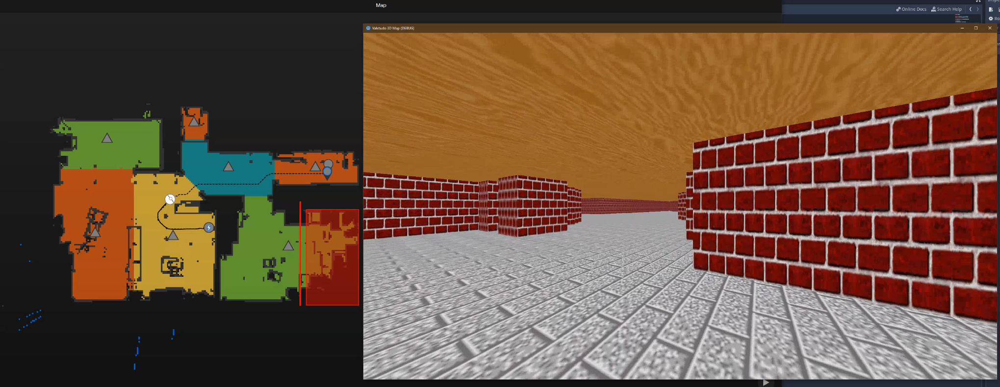

# Valetudo-Godot-Livemap

This Godot project renders a live 3D representation of a Valetudo Map in the Godot Engine

This has been tested with Godot v3.2.3
Please refer to a Godot tutorial if you want to know how to use this

This is an extension of a prototype made by @matpx  
Keep in mind that I have absolutely no experience with Godot. Therefore, the code is pretty bad

To use this, change the `VALETUDO_HOST` const in `src/Root.gd` to match your setup

Ideas:

It should be easy to also add the possibility to control your robot
